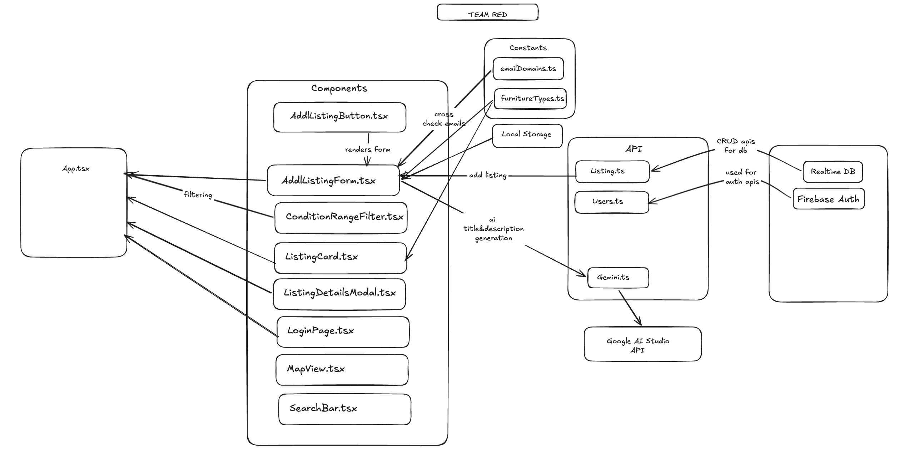
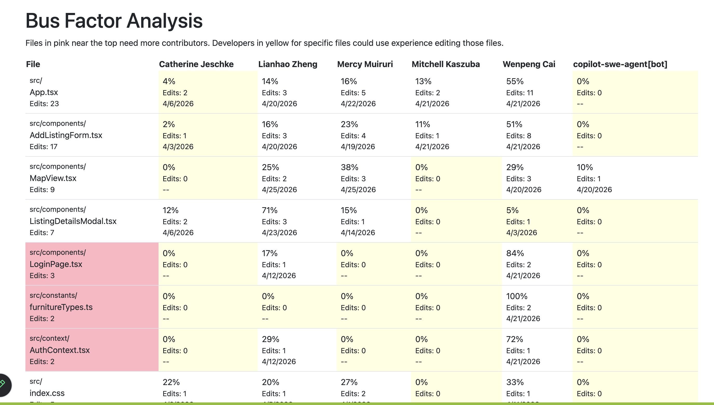

Commit this file to your repo root.

# Architecture & Code Quality Review

**Team:** <Team Red>
**Date:** <27th April, 2026>
**Commit reviewed:** <git sha> 9e6fc5bbf6cf5acbbf653d53df705bf5b4cfab0e

## Architecture diagram

### Surprises & observations

- <thing that surprised you while drawing>
  One thing that surprised us was we thought that  our images were being saved in Firebase Firestore Storage but they were actually being saved as raw bytes in the Realtime Database. This was fine for small images but could present an issue if uploading larger image files.

- <pattern that only became visible once drawn>
  Each user flow had its own component that handled the flow and they were all rendered in the App.tsx. So it was surprising to see all these many files all being called in the App.tsx.
  The App.tsx holds a lot of key features like the "My Furniture" page and handling all the component logic which makes it a very large file to debug and maintain. This shows there could be potential for refactoring the components such that they can be reused in other components as opposed to rewriting the frontend for each feature.

### Diagram vs. reality (top 3 mismatches from madge)

1. A lot more components rely on firebase as shown by madge but we expected only the api files to connect to firebase.
2. A lot of components were not pointing towards the Listing.ts type and this was surprising since the listing.ts holds our apis.
3. CSS diagrams aren't included in our self-made diagram

### Bus factor overlay

- Pink files (concentrated ownership): <19> (6 were part of initial setup and required only one commit)
- Pink files that are also hotspots (large or frequently edited): <4>
- Pink files that are also architectural centers (many other files import them): <4>

Biggest single-person dependency: <one sentence — "If Wenpeng Cai is unavailable, we may face issues debugging the AI connection to Gemini for the addListing feature.">

## Top 5 findings

| #   | Finding                   | File(s)            | Severity | Bus factor           | Why it matters                                                         |
| --- | ------------------------- | ------------------ | -------- | -------------------- | ---------------------------------------------------------------------- |
| 1   | Authentication Bus Factor | LoginPage.tsx      | Medium   | 2 (100% two authors) | Authentication logic is crucial and should be known by all team mates. |
| 2   | Model Example             | App.tsx            | Very Low | 5 (100%, 5 authors)  | Everyone worked on the core app logic                                  |
| 3   | Bus Factor on Design      | Furnituretypes.tsx | High     | 100% 1 author        | One person designed and developed the furniture type constants         |
| 4   | Bus Factor on APIs        | listing.ts         | Medium   | 2 (100% 2 authors)   | Holds the core listing apis                                            |
| 5   | Bus Factor on CSS Design  | App.css            | Medium   | 2 (100% 2 authors)   | Only one person left in the team who worked on the app.css design      |

## Tool output summary

- jscpd: <N duplicated blocks, largest X lines> 5
- madge: <N circular deps, biggest module X> 0
- Largest files: <list top 3 with line counts> AddListingForm.tsx(876), App.tsx(601), ListingDetailsModal(543)
- Unused exports: <count> 4

## What we'd fix first, and why

- Breaking down components to smaller components that can be reused to make it easier to debug and refactor. This will make it easier to debug

## Lessons for the next project

Each phrased as "Next time, we will \_\_\_":

1. Next time we will sketch out the architecture of the app early on so we are all on the same page as we develop.
2. Next time we will plan out services and stack the team will be using to streamline development.
3. Next time have a minimum amount of SWARM sessions a week with a large group to reduce bus factor.
